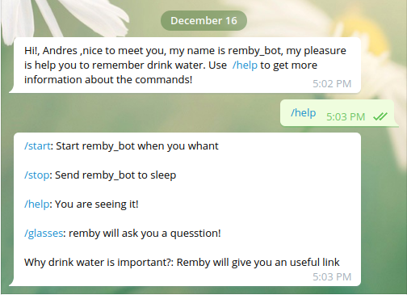

# Remby the Telegram bot

> Remby is a bot made with Ruby best practices, connected with the Telegram APIs thanks to the telegram-ruby-bot gem

Remby is a simple telegram bot created to help you to know how much water you have to drink water. 

## Built With

- Ruby
- telegram-bot-ruby gem
- Heroku

## Getting Started

To get a local copy up and running follow these simple example steps.
- Go to your terminal
- Clone the repo locally with `git clone https://github.com/helman101/telegram-bot.git`
- Go to the project folder `cd telegram-bot`

### Prerequisites

- Ruby
- Heroku

### Try this bot

If you want to see my bot in action you only have to: 

- install [Telegram](https://telegram.org/apps)
- An search for @remby13_bot or put this link http://t.me/remby13_bot in your browser 
- You are ready to start to talk with remby!

### Get Telegram TOKEN

To run the bot locally you must have a telegram bot TOKEN
- Go to this [LINK](https://telegram.me/botfather) to start a conversation with BotFather
- execute the `/newbot` command in the chat
- Follow the simple steps
- And thats all, now your have your own TOKEN

### Implement TOKEN

- Go to `bin/main.rb`
- Change `<TELEGRAM_API_TOKEN>` for the TOKEN you got

### Run tests

- run `ruby bin/main.rb` to run the bot locally 

### Deployment

If you want to deploy your own bot:

- Register in [Heroku](https://www.heroku.com/)
- Install Heroku (CLI)
- Create your bot app in Heroku

## Author

👤 **Andres**

- GitHub: [@helman101](https://github.com/helman101)
- LinkedIn: [helman101](https://www.linkedin.com/in/helman101/)

## 🤝 Contributing

Contributions, issues, and feature requests are welcome!

Feel free to check the [issues page](https://github.com/helman101/telegram-bot/issues).

## Show your support

Give a ⭐️ if you like this project!

## 📝 License

This project is [MIT](https://github.com/helman101/telegram-bot/blob/README/LICENSE) licensed.
